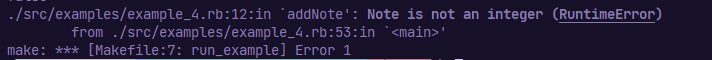
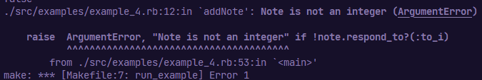
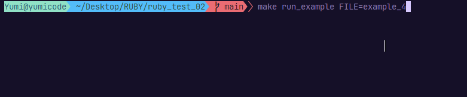

# OOP with Ruby


## Introduction

Ruby is an open source programming language with a focus on simplicity and productivity.

This repo contains examples of object oriented programming with Ruby.

You'll find here some examples of using Ruby for my personnal use and test.

Hope it can help :)

## Summary

- [Tools and version](#tools-and-versions)
- [Folder structure](#folder-structure)
- [Requirements](#requirements)
- [Makefile usage](#makefile-usage)
- [Project](#project)

  - Object Oriented Programming:

    - Create a class & create a method
    - Getter & Setter (or accessor and mutator)
    - Private Methods
    - Call private methods
    - Change core method
    - Comparison method
    - Inheritance
    - Modules
    - Module in module and calling class
    - Mixins and "included"
    - Modules and extend
    - Exceptions

- [Some tips](#tips)

- [Sources](#sources)

## Tools and versions

- OS

  - Kali Linux OS - Ruby v3.1.2
  - Windows OS - Ruby v3.2.2

- IDE
  - VSCodium v1.77.1

## Folder structure

```sh
├── Makefile
├── README.md
└── src
   ├── class.rb
   ├── examples
   |  ├── example_1.rb
   |  ├── example_2.rb
   |  ├── example_3.rb
   |  ├── example_4.rb
   |  └── example_5.rb
   ├── extend.rb
   ├── inheritance.rb
   ├── mixins.rb
   └── module.rb
```

## Requirements

Ruby installed on your machine.

## Makefile Usage

Considering you already have Ruby on your host machine, you can use make to read any file inside this repo

```sh
make run FILE=[name of file]
```

Launch an example :

```sh
make run_example FILE=example_1
```

- example_1 : class & class variables
- example_2 : self method
- example_3 : self method, change core methods
- example_4 : effective application, raise exceptions
- example_5 : modules

## Project

### Object Oriented Programming

- Create a class & create a method:

```rb
class ClassName
    # contructor
    def initialize(params)
        @params = param
    end
    # method
    def method?
        # returns a boolean value
    end
end
```

- Getter & Setter (or accessor and mutator)

```rb
def Class
  attr_accessor :eyeColor #dynamic getter - setter
  attr_reader :petsName #dynamic getter // cannot modified
  attr_writer :petsName #dynamic setter // accessible
    (...)

  def age(age) # setter
    @age = age.to_i
  end

  def getAge # getter
    puts "The age is #{@age}."
  end

  def hairColor=(color) # setter
    @hairColor = color
  end

  def getHairColor # getter
    puts "The hair color is #{@hairColor}!"
  end

    # private method
    private

    def demoPrivate
        puts "This is a private demo, cannot create with an instance"
    end

end


second_person.age(33)
second_person.getAge

second_person.hairColor = "brown"
second_person.getHairColor

second_person.eyeColor = "green"
puts "The eye color is #{second_person.eyeColor}"

second_person.demoPrivate # => error expected
```

- Private Methods

```rb
def Class
    (...)

    # private method
    private

    def demoPrivate
        puts "This is a private demo, cannot create with an instance"
    end

end

second_person.demoPrivate # => error expected
```

- Call private methods

```rb
def Class
    (...)

    # "public" method
    def callPrivateDemo
    demoPrivate
    end

    # private method
    private

    def demoPrivate
        puts "This is a private demo, cannot create with an instance"
    end

end

second_person.demoPrivate # => error expected

second_person.callPrivateDemo # => call private method from a public method
```

- Change core method

```rb
class String
  def sayHi
    "Hello #{self} !"
  end
end

puts "Yumi".sayHi
```

- Comparison method

```rb
class Student
  attr_reader :notes, :name
  AVERAGE = 10

  def initialize(name)
    @name = name
    @notes = []
  end

  def addNote(note)
    @notes << note.to_i
  end

  def average
    @notes.sum / @notes.length
  end

  def hasAverage?
    average >= AVERAGE
  end

  # create comparison method
  def >(student)
    average > student.average
  end
end

student_1 = Student.new("Frodo")
student_2 = Student.new("Sam")

student_1.addNote(1)
student_1.addNote(10)
student_1.addNote(12)
student_1.addNote(7)

puts student_1.notes.inspect

student_1.average

puts "Has over the average ? #{student_1.hasAverage?}"
puts "Average of student_1 #{student_1.name}: #{student_1.average}"

student_2.addNote(16)
student_2.addNote(17)
student_2.addNote(12)
student_2.addNote(19)

# create a comparison method
puts student_1 > student_2
```

- Inheritance

```rb
class Children < Parent
  def getParentMethod
    puts "The parent method is: #{parentMethod}"
  end
end

children = Children.new

children.getParentMethod
```

- Modules

Modules are not class, you cannot have inheritance.
Create module can be used to classify your functionnalities.

Import the module

```rb
#~ import module
# not in core
require "date"

# import module relative to the path, in core
require_relative "inheritance"
require_relative "./examples/example_4.rb"
```

Use the module

```rb
module Circle
  PI = 3.1415

  def self.perimeter(radius)
    2 * PI * radius
  end
end

puts Circle.perimeter(5)

# Call the module property with namespace
puts Circle::PI
```

- Module in module and calling class

```rb
#~ import modules
require "date"
require_relative "../module.rb"

module Geometry
  module Form
    class Circle
      def draw
        puts "drawing"
      end

      def giveDate
        puts Date.today
      end
    end

    def self.givePerimeter(radius)
        CirclePerimeter::perimeter(radius)
    end
  end
end

puts Geometry::Form::Circle.new.draw
puts Geometry::Form::Circle.new.giveDate
puts Geometry::Form.givePerimeter(5)
```

- Mixins and "included"

```rb
module Walk
  def walk
    puts "I walk !"
  end

  # display what's included in this module
  def self.included(base)
    puts base

    def base.test
        puts "This is a test"
    end
  end
end

module Swim
  def swim(test)
    puts "I'm a #{test} and I swim!"
  end
end

class Human
  include Walk
end

class Cat
  include Walk
end

class Dolphin
  include Swim
end


puts Human.new.walk # => I walk !
puts Cat.new.walk # => I walk !
puts Dolphin.new.swim("dolphin") # => I'm a dolphin and I swim!

# can call the method self included
Human.test # => This is a test
```

- Modules and extend

```rb
module A
  def demo(name)
    puts "Hello World, I'm #{name}!"
  end

  def self.extended(base)
    puts "#{base.to_s} extend of module A"
  end
end

class C

  # get all methods of module A, available
  extend A
end

C.demo("Bilbo")

new_c = C.new
# add this keyword to get the method of module A
new_c.extend(A)
new_c.demo("Coraline")

new_c2 = C.new
new_c2.demo("Harry") # => expected error
```

- Exceptions

Raise exception : keyword "raise"

With no error message

```rb
  def addNote(note)
    #! Raise error
    raise if !note.respond_to?(:to_i)
    @notes << note.to_i
  end
```

Result :


Add error message

```rb
  def addNote(note)
    #! Raise error
    raise "Note is not an integer" if !note.respond_to?(:to_i)
    @notes << note.to_i
  end
```

Result :


Add error message and the type

```rb
  def addNote(note)
    #! Raise error
    raise ArgumentError, "Note is not an integer" if !note.respond_to?(:to_i)
    @notes << note.to_i
  end
```

Result :


Add error message and the type and capture the error

```rb
  def addNote(note)
    #! Raise error
    raise ArgumentError, "Note is not an integer" if !note.respond_to?(:to_i)
    @notes << note.to_i
  end

  begin
  student_2.addNote([1, 2, 25])
    # rescue Exception => capture all exceptions
    rescue ArgumentError # => capture exception with given name
  puts "Error: Cannot add note!"
end
```

Result :


Add error message and the type and

```rb
#! CREATE ERRORS
# GOOD PRACTICE to capture all errors
class Error < RuntimeError
end

# Create custom type error
class NoteError < Error
  # define the message
  def initialize(msg = "Error: Cannot add note!")
    super
  end
end

begin # start to check for errors

  student_2.addNote([1, 2, 25])

  # rescue Exception => capture exceptions
rescue NoteError => error # => capture exception with given name
  puts error.to_s
# you can add multiple "rescue" statements

ensure
  puts "End of raised exception"
end
```

## Tips

A variable is considered locally accessible only. Not realy a good practice.

To call a variable as global variable, add : $

```rb
# create global variable
$name = "global variable accessed"

class Article
(...)

  def getName
    puts "The name is: #{$name}"
  end
end

article = Article.new("Hello, world!")

# call the instance method
article.getName
```

Constant variable

```rb
class Article
  # constant variable
  PUNCHLINE = "PUNCHLINE"
(...)

  def changePunchline(punchline)
    PUNCHLINE = punchline
  end
end

article = Article.new("Hello, world!")

article.changePunchline("Punchline changed") # => error expected
```

Change the variable with class variable

```rb
class Article
    @@punchline = "PUNCHLINE THAT CAN BE CHANGED"
(...)

  def canChangePunchline(punchline)
    @@punchline = punchline
  end

  def getNewPunchline
    puts "New punchline: #{@@punchline}"
  end
end

article = Article.new("Hello, world!")

article.canChangePunchline("Punchline changed")
article.getNewPunchline
```

Variables

```txt
"nothing" = local variable
@ = instance variable
@@ = class variable
$ = global variable (rarely used)
UPPERCASE = constant variable

```

If you add something (method or variable) to a Class, Ruby just add it into the class created before.

Self method

```rb
class Person

    def initialize(name)
        @name = name
    end

    def self.sayHi(name)
        puts "Hello #{name}!"
    end

    def sayHi
        # call class method
        # self is like "this" in JS
        self.class.sayHi(@name) # careful, instance variable
    end
end

person = Person.new("John")

person.sayHi
```

---

## Sources

- [Inheritance](https://www.rubyguides.com/2019/01/what-is-inheritance-in-ruby/)
- [Ruby avec Grafikart](https://github.com/Grafikart?tab=repositories)
